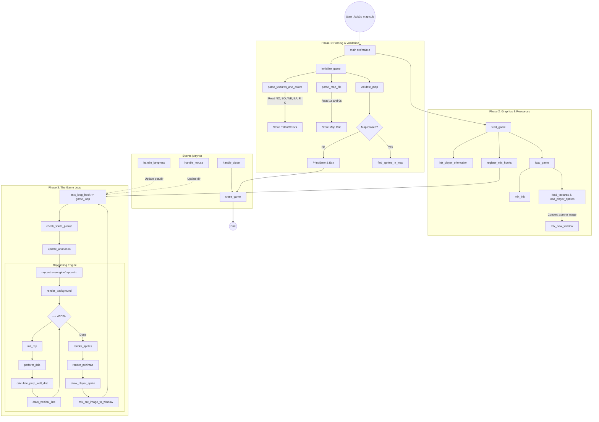

```mermaid
graph TD
    Start((Start ./cub3d map.cub)) --> Main[main src/main.c]
    
    subgraph Parsing ["Phase 1: Parsing & Validation"]
        Main --> InitGame[initialize_game]
        InitGame --> ParseTex[parse_textures_and_colors]
        ParseTex --> |Read NO, SO, WE, EA, F, C| StoreTex[Store Paths/Colors]
        InitGame --> ParseMap[parse_map_file]
        ParseMap --> |Read 1s and 0s| StoreMap[Store Map Grid]
        InitGame --> Validate[validate_map]
        Validate --> FloodFill{Map Closed?}
        FloodFill -- No --> Error[Print Error & Exit]
        FloodFill -- Yes --> FindSprites[find_sprites_in_map]
    end

    subgraph Setup ["Phase 2: Graphics & Resources"]
        Main --> StartGame[start_game]
        StartGame --> InitPlayer[init_player_orientation]
        StartGame --> LoadGame[load_game]
        LoadGame --> MLXInit[mlx_init]
        LoadGame --> LoadTex[load_textures & load_player_sprites]
        LoadTex --> |Convert .xpm to image| MLXWin[mlx_new_window]
        StartGame --> Hooks[register_mlx_hooks]
    end

    subgraph GameLoop ["Phase 3: The Game Loop"]
        Hooks --> LoopHook[mlx_loop_hook -> game_loop]
        LoopHook --> SpritePickup[check_sprite_pickup]
        SpritePickup --> AnimUpdate[update_animation]
        AnimUpdate --> Raycast[raycast src/engine/raycast.c]
        
        subgraph Rendering ["Raycasting Engine"]
            Raycast --> DrawBG[render_background]
            DrawBG --> WallLoop{x < WIDTH}
            WallLoop --> InitRay[init_ray]
            InitRay --> DDA[perform_dda]
            DDA --> CalcDist[calculate_perp_wall_dist]
            CalcDist --> DrawLine[draw_vertical_line]
            DrawLine --> WallLoop
            WallLoop -- Done --> DrawSprites[render_sprites]
            DrawSprites --> DrawMini[render_minimap]
            DrawMini --> DrawWeapon[draw_player_sprite]
            DrawWeapon --> PushFrame[mlx_put_image_to_window]
        end
    end

    subgraph Inputs ["Events (Async)"]
        KeyPress[handle_keypress] -.-> |Update pos/dir| LoopHook
        Mouse[handle_mouse] -.-> |Update dir| LoopHook
        Close[handle_close] --> CleanExit
    end

    PushFrame --> LoopHook
    Error --> CleanExit[close_game]
    CleanExit --> Stop((End))
```