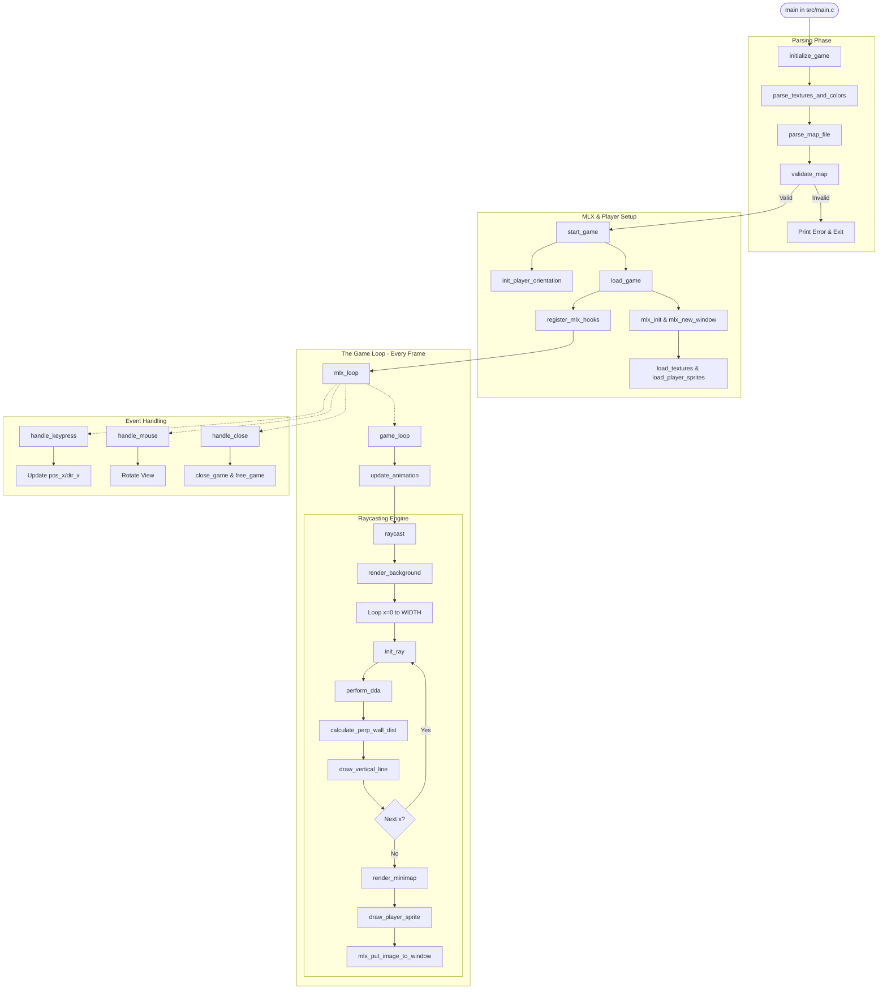

```mermaid
flowchart TD
    Start([main in src/main.c]) --> InitGame[initialize_game]

    subgraph Parsing [Parsing Phase]
        InitGame --> ParseTex[parse_textures_and_colors]
        ParseTex --> ParseMap[parse_map_file]
        ParseMap --> Validate[validate_map]
        Validate -- Invalid --> Error[Print Error & Exit]
    end

    Validate -- Valid --> StartGame[start_game]

    subgraph Setup [MLX & Player Setup]
        StartGame --> InitPos[init_player_orientation]
        StartGame --> LoadGame[load_game]
        LoadGame --> InitMLX[mlx_init & mlx_new_window]
        InitMLX --> LoadTex[load_textures & load_player_sprites]
        LoadGame --> Hooks[register_mlx_hooks]
    end

    Hooks --> MLXLoop[mlx_loop]

    subgraph GameLoop [The Game Loop - Every Frame]
        MLXLoop -.-> LoopHook[game_loop]
        LoopHook --> Anim[update_animation]
        Anim --> Raycast[raycast]
        
        subgraph Rendering [Raycasting Engine]
            Raycast --> RenderBG[render_background]
            RenderBG --> CastRays[Loop x=0 to WIDTH]
            CastRays --> InitRay[init_ray]
            InitRay --> DDA[perform_dda]
            DDA --> CalcDist[calculate_perp_wall_dist]
            CalcDist --> DrawWall[draw_vertical_line]
            DrawWall --> NextRay{Next x?}
            NextRay -- Yes --> InitRay
            NextRay -- No --> Minimap[render_minimap]
            Minimap --> Sprite[draw_player_sprite]
            Sprite --> PushImg[mlx_put_image_to_window]
        end
    end

    subgraph Events [Event Handling]
        MLXLoop -.-> KeyPress[handle_keypress]
        KeyPress --> MoveRot[Update pos_x/dir_x]
        
        MLXLoop -.-> MouseMove[handle_mouse]
        MouseMove --> RotView[Rotate View]
        
        MLXLoop -.-> Destroy[handle_close]
        Destroy --> CleanExit[close_game & free_game]
    end
```