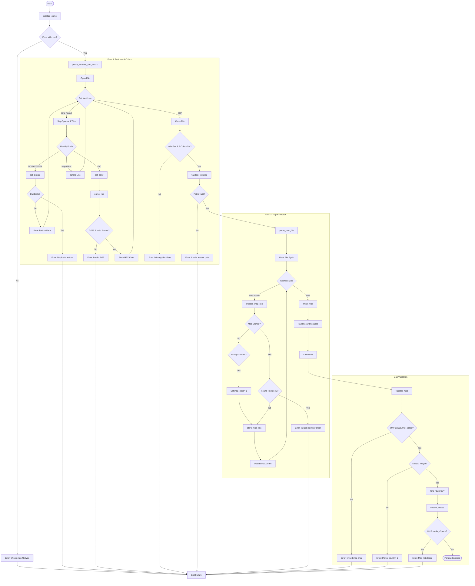

```mermaid
flowchart TD
    %% Entry Point
    Start([main]) --> Init[initialize_game]
    Init --> CheckExt{Ends with .cub?}
    CheckExt -- No --> ErrType[Error: Wrong map file type]
    CheckExt -- Yes --> ParseConfig[parse_textures_and_colors]

    %% Pass 1: Textures & Colors
    subgraph Pass1 [Pass 1: Textures & Colors]
        ParseConfig --> OpenFile1[Open File]
        OpenFile1 --> ReadLoop1{Get Next Line}
        
        ReadLoop1 -- Line Found --> Trim[Skip Spaces & Trim]
        Trim --> CheckID{Identify Prefix}
        
        CheckID -- NO/SO/WE/EA --> SetTex[set_texture]
        SetTex --> DupTex{Duplicate?}
        DupTex -- Yes --> ErrDup[Error: Duplicate texture]
        DupTex -- No --> StorePath[Store Texture Path]
        
        CheckID -- F/C --> SetCol[set_color]
        SetCol --> ParseRGB[parse_rgb]
        ParseRGB --> ValidRGB{0-255 & Valid Format?}
        ValidRGB -- No --> ErrRGB[Error: Invalid RGB]
        ValidRGB -- Yes --> StoreRGB[Store HEX Color]
        
        CheckID -- Map/Other --> Ignore1[Ignore Line]
        
        StorePath --> ReadLoop1
        StoreRGB --> ReadLoop1
        Ignore1 --> ReadLoop1
        
        ReadLoop1 -- EOF --> Close1[Close File]
        Close1 --> CheckAllSet{All 4 Tex & 2 Colors Set?}
        CheckAllSet -- No --> ErrMiss[Error: Missing identifiers]
        CheckAllSet -- Yes --> ValidPaths[validate_textures]
        ValidPaths --> PathCheck{Paths valid?}
        PathCheck -- No --> ErrPath[Error: Invalid texture path]
    end

    PathCheck -- Yes --> ParseMap[parse_map_file]

    %% Pass 2: Map Extraction
    subgraph Pass2 [Pass 2: Map Extraction]
        ParseMap --> OpenFile2[Open File Again]
        OpenFile2 --> ReadLoop2{Get Next Line}
        
        ReadLoop2 -- Line Found --> ProcessLine[process_map_line]
        ProcessLine --> CheckStart{Map Started?}
        
        CheckStart -- No --> CheckContent{Is Map Content?}
        CheckContent -- Yes --> SetStart[Set map_start = 1]
        SetStart --> StoreLine[store_map_line]
        
        CheckStart -- Yes --> OrderCheck{Found Texture ID?}
        OrderCheck -- Yes --> ErrOrder[Error: Invalid identifier order]
        OrderCheck -- No --> StoreLine
        
        StoreLine --> UpdateMax[Update max_width]
        UpdateMax --> ReadLoop2
        
        ReadLoop2 -- EOF --> FinishMap[finish_map]
        FinishMap --> Normalize[Pad lines with spaces]
        Normalize --> Close2[Close File]
    end

    Close2 --> ValidateMap[validate_map]

    %% Validation Logic
    subgraph Validation [Map Validation]
        ValidateMap --> CharCheck{Only 01NSEW or space?}
        CharCheck -- No --> ErrChar[Error: Invalid map char]
        
        CharCheck -- Yes --> CountPlayer{Exact 1 Player?}
        CountPlayer -- No --> ErrPlayer[Error: Player count != 1]
        
        CountPlayer -- Yes --> FindPos[Find Player X,Y]
        FindPos --> FloodFill[floodfill_closed]
        
        FloodFill --> CheckBounds{Hit Boundary/Space?}
        CheckBounds -- Yes --> ErrWall[Error: Map not closed]
        CheckBounds -- No --> Success([Parsing Success])
    end

    %% Error Handling Connections
    ErrType --> Exit[Exit Failure]
    ErrDup --> Exit
    ErrRGB --> Exit
    ErrMiss --> Exit
    ErrPath --> Exit
    ErrOrder --> Exit
    ErrChar --> Exit
    ErrPlayer --> Exit
    ErrWall --> Exit
```