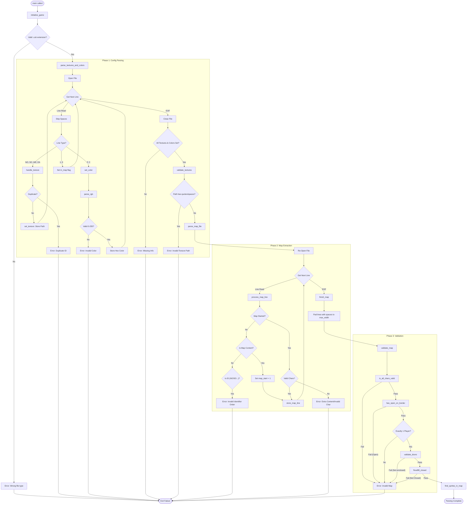

```mermaid
flowchart TD
    Start([main called]) --> Init[initialize_game]
    Init --> CheckFile{Valid .cub extension?}
    CheckFile -- No --> ErrorExt[Error: Wrong file type]
    CheckFile -- Yes --> ParseConfig[parse_textures_and_colors]

    %% Phase 1: Configuration Parsing
    subgraph ConfigPhase [Phase 1: Config Parsing]
        ParseConfig --> OpenFD[Open File]
        OpenFD --> ReadLoop1{Get Next Line}
        
        ReadLoop1 -- Line Read --> Trim[Skip Spaces]
        Trim --> CheckType{Line Type?}
        
        %% Texture Handling
        CheckType -- "NO, SO, WE, EA" --> HandleTex[handle_texture]
        HandleTex --> DupCheck{Duplicate?}
        DupCheck -- Yes --> ErrorDup[Error: Duplicate ID]
        DupCheck -- No --> SetPath[set_texture: Store Path]
        SetPath --> ReadLoop1
        
        %% Color Handling
        CheckType -- "F, C" --> HandleCol[set_color]
        HandleCol --> ParseRGB[parse_rgb]
        ParseRGB --> ValidateRGB{Valid 0-255?}
        ValidateRGB -- No --> ErrorRGB[Error: Invalid Color]
        ValidateRGB -- Yes --> StoreCol[Store Hex Color]
        StoreCol --> ReadLoop1
        
        %% Map Start Detection (Premature)
        CheckType -- "1, 0" --> MarkMap[Set in_map flag]
        MarkMap --> ReadLoop1
        
        %% Validation of Phase 1
        ReadLoop1 -- EOF --> CloseFD[Close File]
        CloseFD --> CheckAllSet{All Textures & Colors Set?}
        CheckAllSet -- No --> ErrorMiss[Error: Missing Info]
        CheckAllSet -- Yes --> ValTex[validate_textures]
        ValTex --> PathCheck{Path has quotes/spaces?}
        PathCheck -- Yes --> ErrorPath[Error: Invalid Texture Path]
        PathCheck -- No --> ParseMap[parse_map_file]
    end

    %% Phase 2: Map Extraction
    subgraph MapPhase [Phase 2: Map Extraction]
        ParseMap --> ReOpen[Re-Open File]
        ReOpen --> ReadLoop2{Get Next Line}
        
        ReadLoop2 -- Line Read --> ProcLine[process_map_line]
        ProcLine --> CheckStarted{Map Started?}
        
        %% Before Map Starts
        CheckStarted -- No --> CheckContent{Is Map Content?}
        CheckContent -- No --> CheckOrder{"Is ID (NO/SO...)?"}
        CheckOrder -- Yes --> ErrorOrder[Error: Invalid Identifier Order]
        CheckContent -- Yes --> SetStart[Set map_start = 1]
        SetStart --> Store[store_map_line]
        
        %% After Map Starts
        CheckStarted -- Yes --> ValidContent{Valid Chars?}
        ValidContent -- No --> ErrorContent[Error: Extra Content/Invalid Char]
        ValidContent -- Yes --> Store
        Store --> ReadLoop2
        
        ReadLoop2 -- EOF --> FinishMap[finish_map]
        FinishMap --> Normalize[Pad lines with spaces to max_width]
    end

    Normalize --> Validate[validate_map]

    %% Phase 3: Validation
    subgraph ValidatePhase [Phase 3: Validation]
        Validate --> CharCheck[is_all_chars_valid]
        CharCheck -- Fail --> ErrorMap[Error: Invalid Map]
        CharCheck -- Pass --> BorderCheck[has_open_on_border]
        BorderCheck -- Fail (Open) --> ErrorMap
        BorderCheck -- Pass --> PlayerCount{Exactly 1 Player?}
        PlayerCount -- No --> ErrorMap
        PlayerCount -- Yes --> DoorCheck[validate_doors]
        DoorCheck -- Fail (Not enclosed) --> ErrorMap
        DoorCheck -- Pass --> FloodFill[floodfill_closed]
        FloodFill -- Fail (Not Closed) --> ErrorMap
    end

    FloodFill -- Pass --> FindSprites[find_sprites_in_map]
    FindSprites --> Success([Parsing Complete])
    
    ErrorExt & ErrorDup & ErrorRGB & ErrorMiss & ErrorPath & ErrorOrder & ErrorContent & ErrorMap --> Fail([Exit Failure])
```