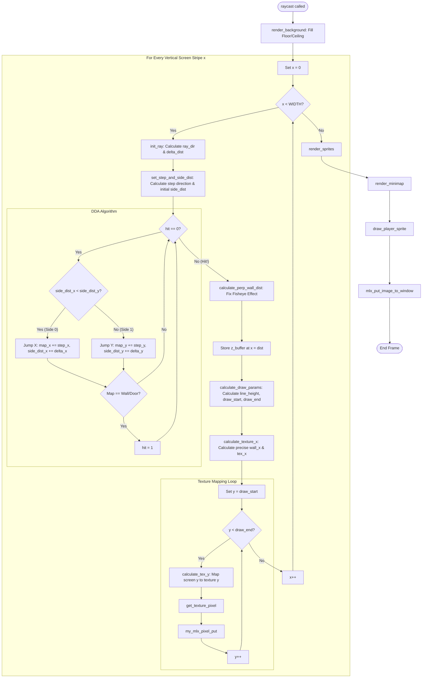

```mermaid
flowchart TD
    Start([raycast called]) --> DrawBG[render_background: Fill Floor/Ceiling]
    DrawBG --> InitLoop[Set x = 0]
    
    subgraph RayLoop [For Every Vertical Screen Stripe x]
        InitLoop --> CheckX{x < WIDTH?}
        CheckX -- No --> DrawSprites[render_sprites]
        
        %% Step 1: Initialization
        CheckX -- Yes --> InitRay[init_ray: Calculate ray_dir & delta_dist]
        InitRay --> SetStep[set_step_and_side_dist: Calculate step direction & initial side_dist]
        SetStep --> DDAStart{hit == 0?}
        
        %% Step 2: DDA Algorithm
        subgraph DDA [DDA Algorithm]
            DDAStart -- Yes --> CompareDist{side_dist_x < side_dist_y?}
            CompareDist -- Yes (Side 0) --> JumpX[Jump X: map_x += step_x, side_dist_x += delta_x]
            CompareDist -- No (Side 1) --> JumpY[Jump Y: map_y += step_y, side_dist_y += delta_y]
            JumpX --> CheckHit{Map == Wall/Door?}
            JumpY --> CheckHit
            CheckHit -- Yes --> SetHit[hit = 1]
            CheckHit -- No --> DDAStart
            SetHit --> DDAStart
        end
        
        %% Step 3: Geometry Calculations
        DDAStart -- No (Hit!) --> CalcDist[calculate_perp_wall_dist: Fix Fisheye Effect]
        CalcDist --> SaveZ[Store z_buffer at x = dist]
        SaveZ --> CalcHeight[calculate_draw_params: Calculate line_height, draw_start, draw_end]
        CalcHeight --> CalcTexX[calculate_texture_x: Calculate precise wall_x & tex_x]
        
        %% Step 4: Texture Drawing
        CalcTexX --> DrawLineStart[Set y = draw_start]
        subgraph DrawTexture [Texture Mapping Loop]
            DrawLineStart --> CheckY{y < draw_end?}
            CheckY -- Yes --> CalcTexY[calculate_tex_y: Map screen y to texture y]
            CalcTexY --> GetColor[get_texture_pixel]
            GetColor --> PutPixel[my_mlx_pixel_put]
            PutPixel --> NextY[y++]
            NextY --> CheckY
        end
        
        CheckY -- No --> NextX[x++]
        NextX --> CheckX
    end

    %% Step 5: Post-Processing
    DrawSprites --> DrawMini[render_minimap]
    DrawMini --> DrawWeapon[draw_player_sprite]
    DrawWeapon --> PushWin[mlx_put_image_to_window]
    PushWin --> End([End Frame])
```