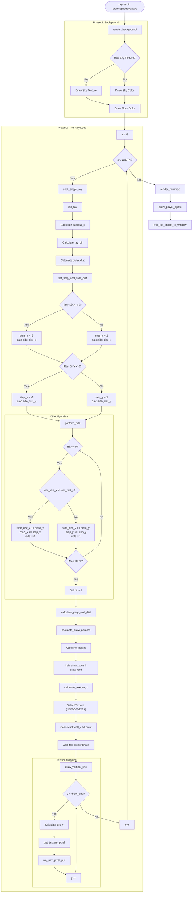

```mermaid
flowchart TD
    %% Entry Point
    Start([raycast in src/engine/raycast.c]) --> RenderBG[render_background]
    
    subgraph Background [Phase 1: Background]
        RenderBG --> CheckSky{Has Sky Texture?}
        CheckSky -- Yes --> RenderSkyTex[Draw Sky Texture]
        CheckSky -- No --> RenderSkyCol[Draw Sky Color]
        RenderSkyTex --> RenderFloor[Draw Floor Color]
        RenderSkyCol --> RenderFloor
    end

    RenderFloor --> InitLoop[x = 0]

    %% The Main Ray Loop
    subgraph RayLoop [Phase 2: The Ray Loop]
        InitLoop --> LoopCondition{x < WIDTH?}
        
        LoopCondition -- Yes --> CastRay[cast_single_ray]
        
        %% Step 1: Ray Initialization
        CastRay --> InitRay[init_ray]
        InitRay --> CalcCam[Calculate camera_x]
        CalcCam --> CalcDir[Calculate ray_dir]
        CalcDir --> CalcDelta[Calculate delta_dist]
        
        %% Step 2: DDA Prep
        CalcDelta --> SetStep[set_step_and_side_dist]
        SetStep --> CheckDirX{Ray Dir X < 0?}
        CheckDirX -- Yes --> StepLeft[step_x = -1\ncalc side_dist_x]
        CheckDirX -- No --> StepRight[step_x = 1\ncalc side_dist_x]
        
        StepLeft --> CheckDirY{Ray Dir Y < 0?}
        StepRight --> CheckDirY
        CheckDirY -- Yes --> StepUp[step_y = -1\ncalc side_dist_y]
        CheckDirY -- No --> StepDown[step_y = 1\ncalc side_dist_y]

        %% Step 3: DDA Algorithm
        StepUp --> DDA[perform_dda]
        StepDown --> DDA
        
        subgraph DDA_Algo [DDA Algorithm]
            DDA --> DDALoop{Hit == 0?}
            DDALoop -- Yes --> CompareDist{side_dist_x < side_dist_y?}
            
            CompareDist -- Yes --> JumpX[side_dist_x += delta_x\nmap_x += step_x\nside = 0]
            CompareDist -- No --> JumpY[side_dist_y += delta_y\nmap_y += step_y\nside = 1]
            
            JumpX --> CheckWall{Map Hit '1'?}
            JumpY --> CheckWall
            
            CheckWall -- No --> DDALoop
            CheckWall -- Yes --> HitFound[Set hit = 1]
        end

        HitFound --> CalcDist[calculate_perp_wall_dist]
        
        %% Step 4: Drawing Calculations
        CalcDist --> CalcHeight[calculate_draw_params]
        CalcHeight --> LineH[Calc line_height]
        LineH --> DrawStartEnd[Calc draw_start & draw_end]
        
        DrawStartEnd --> CalcTexX[calculate_texture_x]
        CalcTexX --> SelectTex["Select Texture (NO/SO/WE/EA)"]
        SelectTex --> WallX[Calc exact wall_x hit point]
        WallX --> TexX[Calc tex_x coordinate]
        
        %% Step 5: Texture Rendering
        TexX --> DrawLine[draw_vertical_line]
        
        subgraph DrawPixels [Texture Mapping]
            DrawLine --> PixelLoop{y < draw_end?}
            PixelLoop -- Yes --> CalcTexY[Calculate tex_y]
            CalcTexY --> GetColor[get_texture_pixel]
            GetColor --> PutPixel[my_mlx_pixel_put]
            PutPixel --> IncY[y++]
            IncY --> PixelLoop
        end
        
        PixelLoop -- No --> NextRay[x++]
        NextRay --> LoopCondition
    end

    %% Phase 3: Bonus Rendering
    LoopCondition -- No --> Minimap[render_minimap]
    Minimap --> Sprite[draw_player_sprite]
    Sprite --> PushFrame[mlx_put_image_to_window]
```